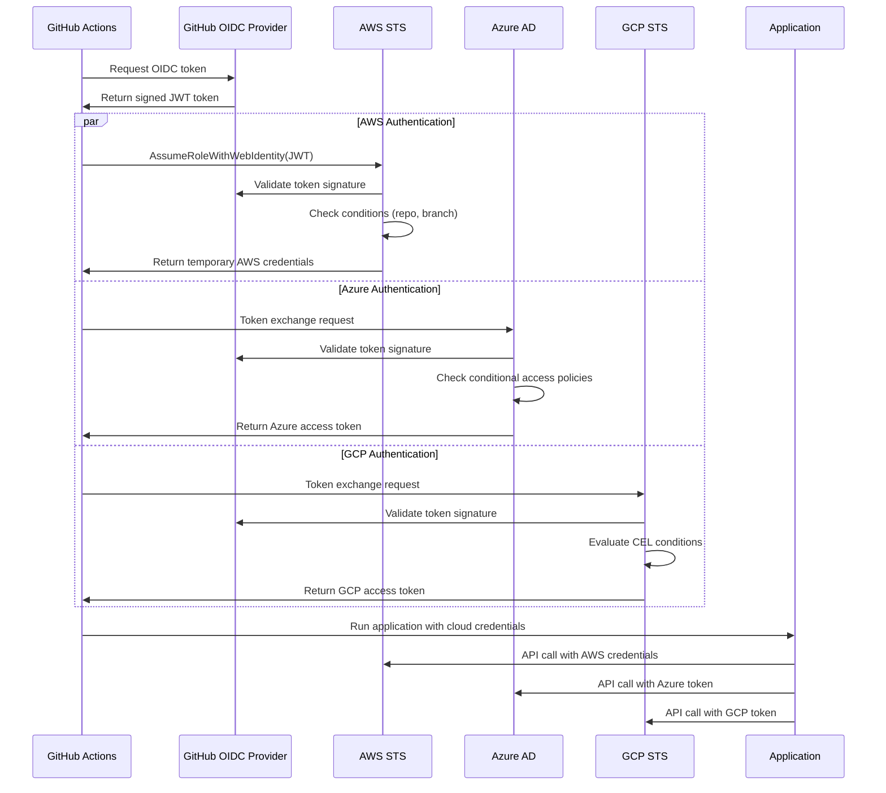

# Multi-Cloud Federated Identity: Technology Deep Dive

## Table of Contents
1. [Overview](#overview)
2. [Core Technologies](#core-technologies)
3. [Authentication Flow](#authentication-flow)
4. [Cloud Provider Implementations](#cloud-provider-implementations)
5. [Security Architecture](#security-architecture)
6. [Token Lifecycle Management](#token-lifecycle-management)
7. [Network and Protocol Details](#network-and-protocol-details)
8. [Performance and Scalability](#performance-and-scalability)

## Overview

Federated identity enables secure authentication across multiple systems without requiring users or applications to maintain separate credentials for each system. In our multi-cloud implementation, we use OpenID Connect (OIDC) tokens from GitHub Actions to authenticate to AWS, Azure, and Google Cloud Platform (GCP) without storing any long-lived credentials.

### The Challenge

Traditional multi-cloud authentication requires:
- Storing long-lived API keys or service account credentials
- Managing credential rotation across multiple systems  
- Securing credential storage and distribution
- Auditing credential usage across different platforms

### The Solution

Federated identity eliminates these challenges by:
- Using short-lived tokens (15 minutes) instead of long-lived credentials
- Leveraging existing trusted identity providers (GitHub Actions)
- Providing just-in-time access with automatic expiration
- Creating comprehensive audit trails across all cloud providers

## Core Technologies

### 1. OpenID Connect (OIDC) 1.0

**Purpose**: Industry-standard protocol for federated authentication built on OAuth 2.0

**Key Features**:
- JSON Web Token (JWT) based identity tokens
- Standardized claims for identity attributes
- Built-in security features (nonce, state parameters)
- Public key cryptography for token verification

**Token Structure**:
```json
{
  "header": {
    "typ": "JWT",
    "alg": "RS256",
    "kid": "key-id-123"
  },
  "payload": {
    "iss": "https://token.actions.githubusercontent.com",
    "sub": "repo:komodt01/Federated-Identity:ref:refs/heads/main",
    "aud": "https://iam.googleapis.com/projects/123/locations/global/workloadIdentityPools/pool/providers/provider",
    "exp": 1640995200,
    "iat": 1640991600,
    "nbf": 1640991600,
    "jti": "unique-token-id",
    "actor": "komodt01",
    "repository": "komodt01/Federated-Identity",
    "ref": "refs/heads/main",
    "sha": "abc123..."
  },
  "signature": "digital_signature_here"
}
```

### 2. JSON Web Tokens (JWT)

**Algorithm**: RS256 (RSA Signature with SHA-256)
**Key Management**: 
- Public keys distributed via JWKS (JSON Web Key Set) endpoints
- Regular key rotation (typically 24-48 hours)
- Multiple active keys to support rotation overlap

**Validation Process**:
1. **Signature Verification**: Verify token signature using public key
2. **Claims Validation**: Check issuer, audience, expiration
3. **Custom Claims**: Validate repository, branch, and actor claims
4. **Condition Evaluation**: Apply conditional access rules

### 3. OAuth 2.0 Token Exchange

**Grant Type**: `urn:ietf:params:oauth:grant-type:token-exchange` (RFC 8693)

**Flow**:
```
1. GitHub Actions generates OIDC token
2. Token submitted to cloud provider STS endpoint
3. Cloud provider validates token signature and claims
4. Cloud provider issues temporary credentials
5. Application uses temporary credentials for API calls
```

## Authentication Flow

### Detailed Step-by-Step Process



### Token Validation Process

Each cloud provider performs these validation steps:

1. **Signature Verification**
   ```bash
   # Pseudo-code for token validation
   public_key = fetch_jwks_key(token.header.kid, issuer_url)
   if (!verify_signature(token, public_key)) {
       throw "Invalid token signature"
   }
   ```

2. **Standard Claims Validation**
   ```json
   {
     "iss": "https://token.actions.githubusercontent.com", // Must match configured issuer
     "aud": "sts.amazonaws.com", // Must match expected audience
     "exp": 1640995200, // Must be in the future
     "iat": 1640991600, // Must be reasonable (not too old)
     "nbf": 1640991600  // Must be current or past
   }
   ```

3. **Custom Claims Validation**
   ```json
   {
     "sub": "repo:komodt01/Federated-Identity:ref:refs/heads/main", // Repository and branch
     "actor": "komodt01", // GitHub username
     "repository": "komodt01/Federated-Identity", // Full repository name
     "ref": "refs/heads/main" // Git reference
   }
   ```

## Cloud Provider Implementations

### Amazon Web Services (AWS)

**Components**:
- **OIDC Identity Provider**: Registers GitHub as trusted issuer
- **IAM Role**: Defines permissions and trust policy
- **STS Service**: Exchanges OIDC tokens for AWS credentials

**Trust Policy Example**:
```json
{
  "Version": "2012-10-17",
  "Statement": [{
    "Effect": "Allow",
    "Principal": {
      "Federated": "arn:aws:iam::ACCOUNT:oidc-provider/token.actions.githubusercontent.com"
    },
    "Action": "sts:AssumeRoleWithWebIdentity",
    "Condition": {
      "StringEquals": {
        "token.actions.githubusercontent.com:aud": "sts.amazonaws.com",
        "token.actions.githubusercontent.com:sub": "repo:komodt01/Federated-Identity:ref:refs/heads/main"
      },
      "StringLike": {
        "token.actions.githubusercontent.com:actor": "komodt01"
      }
    }
  }]
}
```

**Security Features**:
- IP address restrictions via condition keys
- Time-based access controls
- MFA requirements for sensitive operations
- Session duration limits (1-12 hours)

### Microsoft Azure

**Components**:
- **App Registration**: Defines application identity and permissions
- **Service Principal**: Runtime representation of the application
- **Federated Identity Credentials**: OIDC trust configuration

**Federated Credential Configuration**:
```json
{
  "name": "github-actions-credential",
  "issuer": "https://token.actions.githubusercontent.com",
  "subject": "repo:komodt01/Federated-Identity:ref:refs/heads/main",
  "audiences": ["api://AzureADTokenExchange"],
  "description": "GitHub Actions OIDC federation"
}
```

**Conditional Access Integration**:
```json
{
  "conditions": {
    "applications": {
      "includeApplications": ["app-id-here"]
    },
    "locations": {
      "includeLocations": ["AllTrusted"]
    },
    "clientApps": {
      "includeServicePrincipals": ["service-principal-id"]
    }
  },
  "grantControls": {
    "operator": "OR",
    "builtInControls": ["mfa", "compliantDevice"]
  }
}
```

### Google Cloud Platform (GCP)

**Components**:
- **Workload Identity Pool**: Logical grouping of external identities
- **Workload Identity Provider**: OIDC provider configuration within a pool
- **Service Account**: GCP service account that external identities can impersonate

**Provider Configuration**:
```yaml
workloadIdentityPoolProvider:
  displayName: "GitHub Actions OIDC"
  oidc:
    issuerUri: "https://token.actions.githubusercontent.com"
    allowedAudiences: 
      - "https://iam.googleapis.com/projects/PROJECT/locations/global/workloadIdentityPools/POOL/providers/PROVIDER"
  attributeMapping:
    "google.subject": "assertion.sub"
    "attribute.repository": "assertion.repository"
    "attribute.actor": "assertion.actor"
    "attribute.ref": "assertion.ref"
  attributeCondition: |
    assertion.repository == "komodt01/Federated-Identity" &&
    assertion.ref == "refs/heads/main" &&
    assertion.actor == "komodt01"
```

**CEL (Common Expression Language) Conditions**:
```cel
// Time-based access (business hours only)
request.time.getHours() >= 9 && request.time.getHours() <= 17 &&
request.time.getDayOfWeek() >= 1 && request.time.getDayOfWeek() <= 5

// Repository and branch validation
attribute.repository == "komodt01/Federated-Identity" &&
attribute.ref == "refs/heads/main"

// Geographic restrictions
request.region in ["us-central1", "us-east1", "europe-west1"]

// Token freshness validation
request.time - timestamp(attribute.iat) < duration("30m")
```

## Security Architecture

### Defense in Depth Strategy

**Layer 1: Token-Level Security**
- Digital signature validation using RS256
- Token expiration enforcement (15 minutes max)
- Replay attack prevention through nonce and jti claims
- Audience validation to prevent token misuse

**Layer 2: Conditional Access**
- Repository and branch restrictions
- Actor (user) validation
- Time-based access controls
- Geographic restrictions
- IP address filtering

**Layer 3: Permission Boundaries**
- Least privilege principle enforcement
- Resource-specific access controls
- Action-level permission restrictions
- Cross-service access limitations

**Layer 4: Audit and Monitoring**
- Comprehensive logging of all authentication events
- Real-time anomaly detection
- Failed authentication alerting
- Regular access reviews and compliance reporting

### Cryptographic Implementation

**Key Management**:
```
GitHub OIDC Provider:
├── Primary Signing Key (RSA 2048-bit)
├── Secondary Signing Key (RSA 2048-bit) 
├── Key Rotation Schedule (24-48 hours)
└── Public Key Distribution (JWKS endpoint)

Token Signature:
├── Algorithm: RS256 (RSASSA-PKCS1-v1_5 with SHA-256)
├── Key ID: Included in JWT header
├── Signature: Base64URL encoded
└── Verification: Public key from JWKS endpoint
```

**Token Validation Chain**:
1. **Fetch Public Key**: Retrieve from `https://token.actions.githubusercontent.com/.well-known/jwks`
2. **Verify Signature**: Validate JWT signature using retrieved public key
3. **Check Standard Claims**: Validate iss, aud, exp, iat, nbf
4. **Validate Custom Claims**: Check repository, actor, ref claims
5. **Apply Conditions**: Evaluate cloud-specific conditional access rules

## Token Lifecycle Management

### GitHub Actions OIDC Token Generation

**Token Request Process**:
```bash
# GitHub Actions automatically sets these environment variables
ACTIONS_ID_TOKEN_REQUEST_TOKEN=<request_token>
ACTIONS_ID_TOKEN_REQUEST_URL=<request_url>

# Request OIDC token with specific audience
curl -H "Authorization: bearer $ACTIONS_ID_TOKEN_REQUEST_TOKEN" \
     -H "Accept: application/json; api-version=2.0" \
     -H "Content-Type: application/json" \
     "$ACTIONS_ID_TOKEN_REQUEST_URL&audience=sts.amazonaws.com"
```

**Token Lifecycle Stages**:
1. **Generation** (0-1 seconds): GitHub generates signed JWT
2. **Distribution** (1-2 seconds): Token provided to workflow
3. **Exchange** (2-5 seconds): Token exchanged for cloud credentials
4. **Usage** (5 seconds - 15 minutes): Credentials used for API calls
5. **Expiration** (15 minutes): Token becomes invalid

### Cloud Provider Token Caching

**AWS STS Token Caching**:
```python
class AWSTokenCache:
    def __init__(self):
        self.tokens = {}
        self.refresh_threshold = 300  # 5 minutes before expiry
    
    def get_credentials(self, role_arn, session_name):
        cache_key = f"{role_arn}:{session_name}"
        
        if cache_key in self.tokens:
            credentials = self.tokens[cache_key]
            if self.is_expired(credentials, self.refresh_threshold):
                credentials = self.refresh_credentials(role_arn, session_name)
                self.tokens[cache_key] = credentials
        else:
            credentials = self.assume_role(role_arn, session_name)
            self.tokens[cache_key] = credentials
            
        return credentials
```

## Network and Protocol Details

### HTTPS/TLS Requirements

**TLS Configuration**:
- **Minimum Version**: TLS 1.2
- **Preferred Version**: TLS 1.3
- **Cipher Suites**: ECDHE+AESGCM, ECDHE+CHACHA20, DHE+AESGCM
- **Certificate Validation**: Full chain validation required
- **HSTS**: HTTP Strict Transport Security enforced

**Endpoint Security**:
```
GitHub OIDC Endpoints:
├── /.well-known/openid_configuration
├── /.well-known/jwks
└── /token (POST only, authenticated)

Cloud Provider STS Endpoints:
├── AWS: https://sts.amazonaws.com/
├── Azure: https://login.microsoftonline.com/{tenant}/oauth2/v2.0/token
└── GCP: https://sts.googleapis.com/v1/token
```

### API Rate Limiting and Throttling

**GitHub Actions Limits**:
- OIDC token requests: 1000 per repository per hour
- Token size: Maximum 8KB
- Concurrent workflows: 20 per repository (free tier)

**Cloud Provider Limits**:
```
AWS STS:
├── AssumeRoleWithWebIdentity: 5000 requests/second
├── Token duration: 15 minutes - 12 hours
└── Session name: 2-64 characters

Azure AD:
├── Token requests: 7000 requests/5 minutes per application
├── Token duration: 1-24 hours (configurable)
└── Concurrent sessions: 300 per service principal

GCP STS:
├── Token requests: 6000 requests/minute per project
├── Token duration: 1 hour (non-configurable)
└── Workload identity pools: 300 per project
```

## Performance and Scalability

### Authentication Latency Analysis

**End-to-End Authentication Times** *(Illustrative Examples)*:
```
Component Breakdown:
├── GitHub OIDC token generation: 100-200ms
├── Token validation by cloud provider: 50-150ms
├── Credential generation: 100-300ms
├── Network latency: 50-200ms (region dependent)
└── Total authentication time: 300-850ms average
```

*Note: These timing estimates are illustrative examples and actual performance will vary based on network conditions, geographic location, and cloud provider load.*

**Optimization Strategies**:
1. **Token Caching**: Cache cloud provider tokens until near expiration
2. **Parallel Authentication**: Authenticate to multiple clouds simultaneously
3. **Regional Optimization**: Use cloud provider endpoints closest to GitHub Actions runners
4. **Connection Pooling**: Reuse HTTPS connections for multiple API calls

### Scalability Patterns

**Horizontal Scaling**:
```yaml
# GitHub Actions matrix strategy for parallel deployment
strategy:
  matrix:
    cloud: [aws, azure, gcp]
    region: [us-east-1, us-west-2, eu-west-1]
  max-parallel: 9

jobs:
  deploy:
    runs-on: ubuntu-latest
    steps:
      - name: Authenticate to ${{ matrix.cloud }}
        uses: ./.github/actions/auth-${{ matrix.cloud }}
        with:
          region: ${{ matrix.region }}
```

**Load Distribution**:
- Multiple GitHub Actions runners for parallel execution
- Regional cloud provider endpoints for reduced latency
- Load balancing across availability zones
- Circuit breaker patterns for failure handling

### Monitoring and Observability

**Key Performance Indicators (KPIs)** *(Illustrative Examples)*:
```json
{
  "authentication_success_rate": "99.95%",
  "average_authentication_time": "425ms",
  "token_exchange_failures": "0.05%",
  "concurrent_authentications": "50 per minute",
  "credential_cache_hit_rate": "85%"
}
```

*Note: These KPIs are illustrative examples for monitoring setup. Actual metrics will vary based on usage patterns and infrastructure.*

**Monitoring Implementation**:
```yaml
# CloudWatch/Azure Monitor/GCP Monitoring metrics
metrics:
  - name: authentication_duration
    type: histogram
    buckets: [100, 250, 500, 1000, 2000, 5000]
    
  - name: authentication_success
    type: counter
    labels: [cloud_provider, repository, actor]
    
  - name: token_validation_errors
    type: counter
    labels: [error_type, cloud_provider]
    
  - name: concurrent_sessions
    type: gauge
    description: "Active federated identity sessions"
```

### Security Monitoring

**Anomaly Detection Patterns**:
```python
class FederatedIdentityMonitor:
    def __init__(self):
        self.baseline_metrics = self.load_baseline()
        self.alert_thresholds = {
            'failed_auth_rate': 0.05,  # 5% failure rate
            'unusual_hours': (22, 6),   # Outside business hours
            'geo_anomaly': True,        # Access from new location
            'burst_requests': 100       # Requests per minute
        }
    
    def detect_anomalies(self, auth_event):
        anomalies = []
        
        # Check for unusual failure rates
        if self.calculate_failure_rate() > self.alert_thresholds['failed_auth_rate']:
            anomalies.append('high_failure_rate')
            
        # Check for off-hours access
        if self.is_outside_business_hours(auth_event.timestamp):
            anomalies.append('off_hours_access')
            
        # Check for geographic anomalies
        if self.is_new_location(auth_event.source_ip):
            anomalies.append('geographic_anomaly')
            
        return anomalies
```

**Alert Configuration**:
```yaml
alerts:
  - name: high_authentication_failures
    condition: failed_authentications > 10 in 5 minutes
    severity: warning
    actions:
      - email: security-team@company.com
      - slack: "#security-alerts"
      
  - name: geographic_anomaly
    condition: authentication from new country
    severity: high
    actions:
      - email: security-team@company.com
      - pagerduty: security-on-call
      - disable_identity_pool: true
```

## Advanced Security Features

### Zero Trust Integration

**Principle Implementation**:
- Never trust, always verify every authentication request
- Continuous validation of identity and device state
- Least privilege access with just-in-time elevation
- Comprehensive logging and monitoring of all access

**Device Trust Validation**:
```cel
// GCP CEL expression for device validation
request.auth.access_levels != null &&
"corporate_network" in request.auth.access_levels &&
request.auth.principal.startsWith("serviceAccount:")
```

### Threat Detection and Response

**Automated Response Actions**:
```python
class ThreatResponse:
    def __init__(self):
        self.response_actions = {
            'credential_stuffing': self.rate_limit_identity,
            'impossible_travel': self.require_additional_auth,
            'token_replay': self.invalidate_tokens,
            'privilege_escalation': self.alert_and_block
        }
    
    def respond_to_threat(self, threat_type, context):
        if threat_type in self.response_actions:
            return self.response_actions[threat_type](context)
        else:
            return self.default_response(threat_type, context)
```

## Future Technology Considerations

### Emerging Standards

**SPIFFE/SPIRE Integration**:
- Secure Production Identity Framework For Everyone
- Automatic workload identity attestation
- Service mesh integration for microservices
- Hardware-based identity validation

**WebAuthn Support**:
- Hardware security key authentication
- Biometric authentication support
- Phishing-resistant authentication methods
- FIDO2 standard compliance

### Quantum-Safe Cryptography

**Preparation for Post-Quantum Security**:
```
Current: RSA 2048-bit + SHA-256
Future: Hybrid approach with quantum-safe algorithms
├── CRYSTALS-Dilithium (signatures)
├── CRYSTALS-KYBER (key exchange)
├── SPHINCS+ (backup signatures)
└── Classical algorithms (transition period)
```

### Performance Optimizations

**Edge Computing Integration**:
- Token validation at edge locations
- Reduced latency for global deployments
- Caching strategies for improved performance
- Regional failover capabilities

## Conclusion

The multi-cloud federated identity implementation leverages industry-standard protocols and cloud-native services to provide secure, scalable, and maintainable authentication across multiple cloud providers. The technology stack combines the robustness of OIDC/OAuth2 with cloud-specific features to create a comprehensive identity solution.

Key technological advantages include:

- **Standards-Based**: Built on OIDC 1.0 and OAuth 2.0 industry standards
- **Zero-Trust Ready**: Continuous verification and least-privilege access
- **Cloud-Native**: Leverages each cloud provider's native identity services
- **Scalable**: Designed for enterprise-scale deployments
- **Secure**: Multiple layers of security controls and monitoring
- **Observable**: Comprehensive logging and monitoring capabilities

This implementation serves as a foundation for organizations adopting multi-cloud strategies while maintaining the highest security and operational standards. The modular architecture allows for easy extension to additional cloud providers and integration with existing enterprise identity systems.
